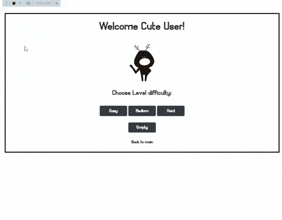

## Sudoku

This is a project I did as part of SV-College's Front-End development course.
It was done by me and another person.
I was responsible for desiging everything to do with the game and board's logic and behaviour. Including but not limited to the initial creation of the board and the 'hint', 'check', 'solve' mechanisms.
- - - - -
#### Features:

- **Guest** and User entrances: A registered user will be able to choose a difficulty, while a guest can only play in easy mode.

- **Difficulty settings**: The user may choose between 3 difficulty settings, which affects the number of hidden tiles on the board as well as the number of hints available to the user. ie:\
 Easy: 20 tiles hidden, 5 hints available.\
 Normal: 40 tiles hidden, 4 hints available.\
 Hard: 60 tiles hidden, 3 hints available.\
 Empty: A completely empty board, no hints. Used in case a user wants, for example, to solve a Sudoku game from a newspaper or other source they may be stuck on. So they can replicate it using the Empty setting and get a solution using this app's features. 

- **'Check' button**:
Causes every row, column or square containing a mistake (a number appearing more than once) to be highlit in red.

- **'Hint' button**:
Will reveal one hidden tile with a correct number.\
*Note*: 'A correct number' doesn't only mean a number that will cause no immidiate errors, but one that can postively lead to a fully solved board. The only way to guarantee this is to solve the entire existing board (behind the scenes) and to extract the value for the hint from the full solution.

- **'Again' button**: Clear all user input and restart the same board.

- **'New Board' button**: Start a new cleared board with different values on the same difficulty level.

- **'Finish' button**: Check if user has succesfully solved the current board, and display a corresponding message.

- **'Solve' button**: Fully solves the current board. It will first try to complete what the user started, as in, it will try to solve the board while keeping the user's input. If the user's input lead to a dead end, it will be cleared and a solution will be provided using the initial board values provided.\
*Note*: This feature does not use a copy of the initial board that was created prior to hiding the necessary number of tiles as the correct solution. Doing so is a mistake since a board with a certain number of hidden tiles can have multiple solutions. Instead it will solve the board on its own every time.

- **'Change Level'** (clickable text): Returns the user to the difficulty selection screen. Current game's progress will not be saved.

- **'Back to main'** (clickable text): Returns to the entrance login screen. Current user will be logged out.

#### Display: Above the game board, the following information will be displayed for the user:
Player name, current board's difficulty, number of hints left available, time elapsed since game started.
Beneath the board is where the aforementioned buttons are, as well as a status message.

-----
###### Further detailed information is in the body of code.
###### For inquiries: asafg86@gmail.com
